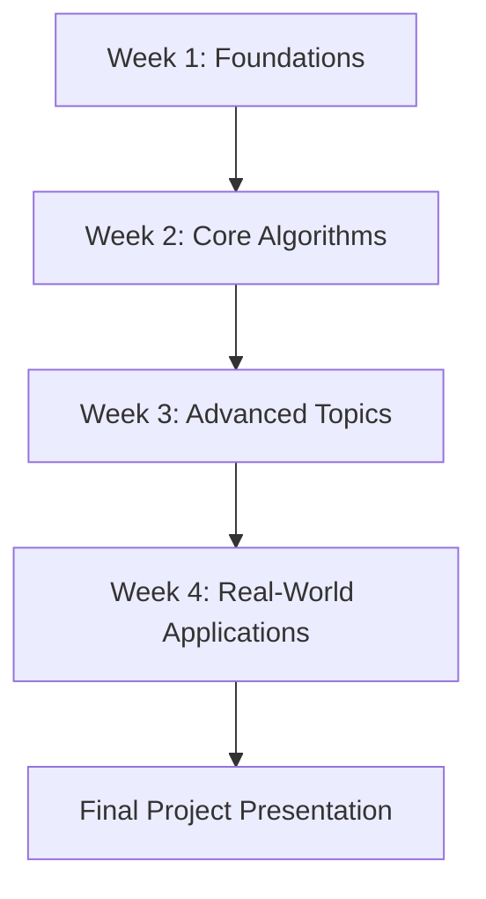

# 30-Day Machine Learning Course for Underprivileged Students 🎓


> A comprehensive, accessible 30-day Machine Learning curriculum designed specifically for underprivileged students.

## 🌟 Overview

This repository contains a complete 30-day Machine Learning course curriculum designed to make ML education accessible to underprivileged students. The course emphasizes practical applications, hands-on learning, and provides extensive support resources.

## 📚 Course Structure

### Week 1: Foundations and Setup
- **Days 1-7**: Python fundamentals, data preprocessing, linear regression
- Focus on building strong programming foundations

### Week 2: Core Algorithms  
- **Days 8-14**: Classification algorithms, ensemble methods, SVMs
- Hands-on implementation of key ML algorithms

### Week 3: Unsupervised Learning & Advanced Topics
- **Days 15-21**: Clustering, PCA, neural networks, model selection
- Exploring unsupervised learning and advanced techniques

### Week 4: Real-World Applications
- **Days 22-30**: Deep learning, NLP, time series, ethics, and final projects
- Practical applications and comprehensive project work

## 🎯 Learning Objectives

By the end of this course, students will be able to:
- ✅ Understand fundamental ML concepts and algorithms
- ✅ Implement ML models using Python and scikit-learn
- ✅ Preprocess and analyze real-world datasets
- ✅ Evaluate and compare different ML approaches
- ✅ Build end-to-end ML projects
- ✅ Understand ethical considerations in AI/ML

## 📖 Required Textbooks & Resources

### Primary Textbooks
1. **"Hands-On Machine Learning"** by Aurélien Géron (2nd Edition) - *Main Text*
2. **"Pattern Recognition and Machine Learning"** by Christopher Bishop - *Theory Reference*
3. **"The Elements of Statistical Learning"** by Hastie, Tibshirani, and Friedman - *Advanced Reference*

### Free Online Resources
- [Andrew Ng's Machine Learning Course](https://www.coursera.org/learn/machine-learning) (Coursera)
- [Kaggle Learn](https://www.kaggle.com/learn)
- [Python Data Science Handbook](https://jakevdp.github.io/PythonDataScienceHandbook/)

## 🛠️ Prerequisites

- Basic programming knowledge (Python preferred)
- High school mathematics (algebra, basic statistics)
- Access to a computer with internet connection
- Enthusiasm to learn! 🚀

## 📁 Repository Structure

```
├── daily-lessons/           # Individual lesson plans for each day
│   ├── day-01/
│   ├── day-02/
│   └── ...
├── assignments/            # Weekly programming assignments
│   ├── week-1/
│   ├── week-2/
│   └── ...
├── projects/              # Final project templates and examples
├── datasets/              # Practice datasets for exercises
├── code-examples/         # Code snippets and examples
├── resources/            # Additional learning materials
│   ├── setup-guide.md
│   ├── python-cheatsheet.md
│   └── ml-glossary.md
├── assessments/          # Quizzes and evaluation materials
└── README.md
```

## 🚀 Getting Started

### 1. Clone the Repository
```bash
git clone https://github.com/raman118/30-Days-ML-Path
```

### 2. Set Up Your Environment
```bash
# Create virtual environment
python -m venv ml-course-env

# Activate virtual environment
# On Windows:
ml-course-env\Scripts\activate
# On macOS/Linux:
source ml-course-env/bin/activate

# Install required packages
pip install -r requirements.txt
```

### 3. Start with Day 1
Navigate to `daily-lessons/day-01/` and begin your ML journey!

## 📋 Daily Structure

Each day includes:
- **📖 Reading Assignment**: Specific textbook chapters and pages
- **🎯 Learning Objectives**: Clear goals for the day
- **💻 Practical Tasks**: Hands-on coding exercises
- **🧠 Key Concepts**: Essential ideas to master
- **📝 Assessment**: Quick quiz or exercise

## 📊 Assessment Strategy

| Component | Weight | Description |
|-----------|--------|-------------|
| Daily Quizzes | 30% | Short quizzes on daily topics |
| Weekly Assignments | 40% | Practical programming assignments |
| Final Project | 30% | Comprehensive capstone project |

## 🤝 Support for Underprivileged Students

This course includes special provisions for underprivileged students:

- 📚 **Free Resources**: Emphasis on free, open-source materials
- 💻 **Technology Access**: Guidance for limited computing resources
- 👥 **Study Groups**: Collaborative learning opportunities
- 🕐 **Flexible Pacing**: Self-paced learning with support
- 🎓 **Mentorship**: Connection with industry professionals
- 📖 **Textbook Lending**: Digital copies and lending library access

## 💻 Technical Requirements

### Minimum System Requirements
- **OS**: Windows 10, macOS 10.14, or Linux
- **RAM**: 4GB (8GB recommended)
- **Storage**: 2GB free space
- **Python**: 3.7 or higher

### Required Python Packages
```
numpy>=1.19.0
pandas>=1.1.0
scikit-learn>=0.24.0
matplotlib>=3.3.0
jupyter>=1.0.0
seaborn>=0.11.0
tensorflow>=2.4.0 (for advanced topics)
```

## 🏆 Projects & Assignments

### Weekly Assignments
- **Week 1**: Data preprocessing and exploration
- **Week 2**: Classification model comparison
- **Week 3**: Clustering analysis project
- **Week 4**: End-to-end ML pipeline

### Final Project Options
1. **Predictive Analytics**: Build a model for real-world prediction
2. **Data Analysis**: Comprehensive analysis of a complex dataset
3. **Social Impact ML**: ML solution addressing social issues
4. **Open Research**: Student-proposed project with instructor approval

## 📈 Course Progression



## 🌍 Community & Support

- **💬 Discussions**: Use GitHub Discussions for questions and collaboration
- **🐛 Issues**: Report bugs or suggest improvements via GitHub Issues
- **📧 Contact**: [professor@haywards-university.edu](mailto:professor@haywards-university.edu)
- **📞 Office Hours**: Daily 2-3 PM (Schedule via course platform)

## 🤝 Contributing

We welcome contributions from the community! Please see our [Contributing Guidelines](CONTRIBUTING.md) for details on:
- How to report bugs
- How to suggest enhancements
- How to submit pull requests
- Code of conduct

## 📄 License

This project is licensed under the MIT License - see the [LICENSE](LICENSE) file for details.

## 🙏 Acknowledgments

- **Hayward's University** for supporting accessible education
- **Open source community** for providing free ML tools and libraries
- **Students and educators** who have contributed to this curriculum
- **Industry mentors** volunteering their time and expertise

## 📚 Additional Resources

### Free Online Courses
- [MIT Introduction to Machine Learning](https://ocw.mit.edu/courses/electrical-engineering-and-computer-science/6-034-artificial-intelligence-fall-2010/)
- [Stanford CS229 Machine Learning](http://cs229.stanford.edu/)
- [Fast.ai Practical Deep Learning](https://course.fast.ai/)

### Practice Platforms
- [Kaggle](https://www.kaggle.com/) - Competitions and datasets
- [Google Colab](https://colab.research.google.com/) - Free GPU access
- [Jupyter.org](https://jupyter.org/) - Interactive computing

### Career Resources
- [ML Engineer Roadmap](https://roadmap.sh/ai-data-scientist)
- [Data Science Interview Questions](https://github.com/alexeygrigorev/data-science-interviews)
- [Open Source ML Projects](https://github.com/topics/machine-learning)

## 📊 Course Statistics

- **Duration**: 30 days
- **Total Lessons**: 30 comprehensive lessons
- **Assignments**: 4 weekly assignments + 1 final project
- **Programming Languages**: Python
- **Difficulty**: Beginner to Intermediate
- **Time Commitment**: 2-3 hours per day

## 🔄 Version History

- **v1.0.0** (Current) - Initial release with complete 30-day curriculum
- **v0.9.0** - Beta release for student testing
- **v0.8.0** - Alpha release for instructor review

---

## 🌟 Star this Repository

If you find this course helpful, please ⭐ star this repository to help others discover it!


---

*Made with ❤️ for accessible machine learning education*

**Happy Learning! 🎉**
